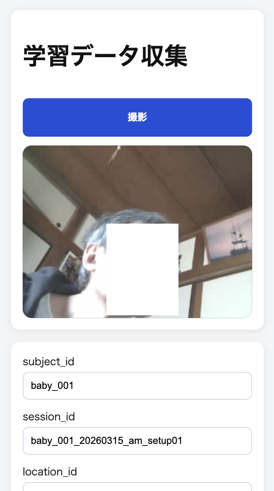

# prone-model

`Freenove ESP32-S3 WROOM CAM` を使い、乳幼児の `うつ伏せ / 非うつ伏せ` 学習用写真データを収集するための ESP-IDF プロジェクトです。

既存 Wi-Fi AP に `STA` 接続し、ESP32 上で Web サーバを起動します。ブラウザからライブストリームを確認し、ラベルを選んで撮影し、SD カードへ保存します。保存済みデータは `metadata.csv` と画像単位で分割エクスポートでき、必要に応じて SD カード内データを全削除できます。

## モチベーション

- YOLOv11n Pose モデルは ESP32-S3 で動かすと 27 秒かかるので現実的でない
- 保証されたうつ伏せ検出モデルが公開されてない
- 顔検出 + α　でうつ伏せ検出するのがほとんど

↓

- マイコンで安価に検出したい
- 顔検出だけで検出したい
- ほぼリアルタイムで検出したい

↓

- 顔検出だけでは無理だった
- うつ伏せ・非うつ伏せ状態そのものを個人の範囲で学習させる仕掛けを作りたい

## 現在のスコープ

- `Freenove ESP32-S3 WROOM CAM` でカメラ映像を取得する
- `sdkconfig` に保存した `SSID` / `PASSWORD` で既存 AP に接続する
- Web UI でストリーミング映像を表示する
- Web UI で `うつ伏せ / 非うつ伏せ` を選択して撮影する
- JPEG 画像と学習用メタデータを SD カードへ保存する
- 保存済みデータを PC 側へ分割ダウンロードする
- SD カード内のデータセットを初期化する

## 現在の実装状態

- 収集機能のみ実装済み
- 推論機能は未実装
- UI/API サーバは `80` 番ポート
- MJPEG ストリームは `81` 番ポート
- 初期フレームサイズは `320 x 240`
- 保存形式は JPEG
- `status` は初回表示時、撮影後、リセット後だけ更新する

学習データ収集インターフェイス



## Web UI

ルート画面 `/` には以下を配置します。

- カメラストリーミング
- 撮影ボタン
- `うつ伏せ / 非うつ伏せ` ラジオボタン
- `エクスポート` ボタン
- `SDカードリセット` ボタン
- `subject_id` 入力欄
- `session_id` 入力欄
- `location_id` 入力欄
- `lighting_id` 入力欄
- `camera_position_id` 入力欄
- `annotator_id` 入力欄
- `学習利用可否` 入力欄
- `除外理由` 入力欄
- `notes` 入力欄

### 現在のレイアウト

- ストリーミング表示はスマホ操作を優先して小さめに表示する
- `撮影` ボタンはストリーミング上部に配置する
- `エクスポート` と `SDカードリセット` は入力欄の下に配置する

## 保存形式

SD カード上には `dataset/` ディレクトリを作成し、以下を保存します。

- `dataset/images/*.jpg`
  撮影した JPEG 画像
- `dataset/metadata.csv`
  全画像に対するメタデータ一覧

### `metadata.csv` の基本列

- `capture_id`
- `timestamp_ms`
- `subject_id`
- `session_id`
- `location_id`
- `lighting_id`
- `camera_position_id`
- `annotator_id`
- `label`
- `label_name`
- `is_usable_for_training`
- `exclude_reason`
- `notes`
- `image_path`
- `image_bytes`
- `frame_width`
- `frame_height`
- `pixel_format`
- `jpeg_quality`
- `board_name`

## 学習データとして追加で残すべき情報

画像だけでは後で偏りや品質問題を潰しにくいので、以下を必須で残します。

- `subject_id`
  被写体単位分割を行うための最重要キー
- `session_id`
  同一環境・同一時間帯・同一被写体群を識別する
- `location_id`
  撮影場所の偏りを監査する
- `lighting_id`
  照明条件の偏りを監査する
- `camera_position_id`
  画角と設置位置の偏りを監査する
- `annotator_id`
  注釈担当差分を監査する
- `timestamp_ms`
  時系列の偏り、連写由来のリーク確認に使う
- `is_usable_for_training`
  曖昧サンプルを学習集合から外す
- `exclude_reason`
  学習利用不可理由を保存する
- `notes`
  後から判断保留や注意点を監査する
- `frame_width` / `frame_height`
  前処理条件を再現する
- `jpeg_quality`
  圧縮率差異を追跡する
- `board_name`
  取得元ハードを識別する
- `image_bytes`
  異常に小さい破損画像や露光失敗を検知する

## エクスポート

エクスポートは巨大アーカイブを 1 回で返さず、以下に分割します。

- `/api/export/metadata`
  `metadata.csv` を取得する
- `/api/export/manifest`
  画像一覧をページ単位で取得する
- `/api/export/image?capture_id=...`
  画像を 1 件ずつ取得する

通信断があっても、未取得画像だけ再試行できます。

### 現在の UI 動作

- `エクスポート` ボタンは `metadata.csv` を取得する
- 続いて `manifest.json` を生成して取得する
- 続いて各 JPEG を 1 件ずつ順次ダウンロードする
- ブラウザ側で複数ダウンロード許可が必要な場合がある
- 大量画像の一括取得はブラウザ依存のため、件数が多い場合は PC 側取得スクリプト化を前提に見直し余地がある

## 設定

Wi-Fi 認証情報は `sdkconfig` に保持します。

- `CONFIG_WIFI_SSID`
- `CONFIG_WIFI_PASSWORD`

リポジトリへ実値をコミットしない前提です。

## 管理外ファイルと生成手順

このリポジトリで、管理外のまま運用する前提のファイルやディレクトリのうち、利用者がコマンド実行で生成するものは以下です。
手動で新規作成しないと進めない必須ファイルはありません。

- `sdkconfig`
  - 用途: `CONFIG_WIFI_SSID`, `CONFIG_WIFI_PASSWORD` などのローカル設定を保持する
  - 生成方法: `idf.py menuconfig` を実行すると生成または更新される
  - 補足: Wi-Fi 認証情報はここで設定し、`vi` などでの手動新規作成は不要
- `.venv/`
  - 用途: PC 側パイプライン実行用の Python 仮想環境
  - 生成方法: `python3 -m venv .venv`
  - 補足: 生成後に `source .venv/bin/activate` と `pip install -e .` を実行する
- `artifacts/pc_pipeline/<run_name>/`
  - 用途: PC 側パイプラインの成果物出力先
  - 生成方法: `python3 -m pc_pipeline --dataset-root /path/to/exported/dataset` を実行すると自動生成される
  - 補足: 事前に `mkdir` や手動作成は不要
- `managed_components/`
  - 用途: `ESP-IDF` のコンポーネント管理で取得された依存物を保持する
  - 生成方法: 初回の `idf.py build` などで必要に応じて自動生成される
  - 補足: 手動作成は不要
- `build/`
  - 用途: `ESP-IDF` ビルド生成物を保持する
  - 生成方法: `idf.py build` を実行すると自動生成される
  - 補足: 手動作成は不要

## API

- `GET /`
  Web UI
- `GET http://<device-ip>:81/stream`
  MJPEG ストリーム
- `GET /api/status`
  状態取得
- `POST /api/capture`
  撮影と保存
- `GET /api/export/manifest`
  ページ単位の画像一覧
- `GET /api/export/metadata`
  `metadata.csv`
- `GET /api/export/image?capture_id=...`
  単一画像取得
- `POST /api/reset`
  データセット初期化

## ドキュメント方針

本リポジトリでは、実装より先に学習データ仕様を閉じます。特に以下を絶対要件とします。

- `subject_id` 必須
- 画像本体保存必須
- `is_usable_for_training` と `exclude_reason` による曖昧サンプル除外
- `subject_id` 単位分割

## ビルド

```bash
source ~/.espressif/v5.5.3/esp-idf/export.sh
idf.py set-target esp32s3
idf.py menuconfig
idf.py build
idf.py -p <PORT> flash monitor
```

## PC でのモデル生成

Mac 上では `python3` を使って PC 側パイプラインを実行します。
最も確実な実行方法は `python3 -m pc_pipeline` です。
`prone-pc-pipeline` は `pip install -e .` 実行後に使えるようになる別名コマンドです。

```bash
python3 -m venv .venv
source .venv/bin/activate
pip install -e .
python3 -m pc_pipeline --dataset-root /path/to/exported/dataset
```

`pip install -e .` の後は、次の別名コマンドでも実行できます。

```bash
prone-pc-pipeline --dataset-root /path/to/exported/dataset
```

主な既定値:

- 入力サイズ: `96 x 96`
- 分割比率: `train=0.70`, `val=0.15`, `test=0.15`
- 乱数シード: `42`
- 学習条件: `epoch=20`, `batch_size=32`, `learning_rate=0.001`
- 初期判定閾値: `0.50`

成果物は `artifacts/pc_pipeline/<run_name>/` に保存します。

- `config.json`
- `dataset_audit.json`
- `splits/train.csv`, `splits/val.csv`, `splits/test.csv`
- `checkpoints/best_model.pt`
- `onnx/model.onnx`
- `reports/metrics.json`
- `reports/threshold.json`

`ESP-DL` 変換コマンドが手元にある場合は、`{onnx_path}` と `{espdl_path}` を含む形で渡します。

```bash
python3 -m pc_pipeline \
  --dataset-root /path/to/exported/dataset \
  --espdl-converter-command "espdl_convert --input {onnx_path} --output {espdl_path}"
```

## 運用メモ

- 同じ収集セッション中は `session_id`, `location_id`, `lighting_id`, `camera_position_id`, `annotator_id` を毎回変える必要はない
- 毎回見直す主な入力は `label`, `is_usable_for_training`, `exclude_reason`, `notes`
- `session_id` は被写体、時間帯、設置条件が変わったときに切り替える

## ドキュメント

- [docs/REQUIREMENTS.md](/Users/kumata/Developer/prone-model/docs/REQUIREMENTS.md)
- [docs/DESIGN.md](/Users/kumata/Developer/prone-model/docs/DESIGN.md)
- [docs/SPECIFICATIONS.md](/Users/kumata/Developer/prone-model/docs/SPECIFICATIONS.md)
- [docs/COLLECTION_POLICY.md](/Users/kumata/Developer/prone-model/docs/COLLECTION_POLICY.md)
- [docs/LABELING_GUIDELINES.md](/Users/kumata/Developer/prone-model/docs/LABELING_GUIDELINES.md)
- [docs/DATA_QUALITY.md](/Users/kumata/Developer/prone-model/docs/DATA_QUALITY.md)
- [docs/NAMING_RULES.md](/Users/kumata/Developer/prone-model/docs/NAMING_RULES.md)
- [docs/ACCEPTANCE_CRITERIA.md](/Users/kumata/Developer/prone-model/docs/ACCEPTANCE_CRITERIA.md)
- [docs/TODO.md](/Users/kumata/Developer/prone-model/docs/TODO.md)
