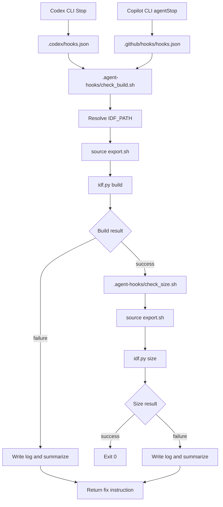
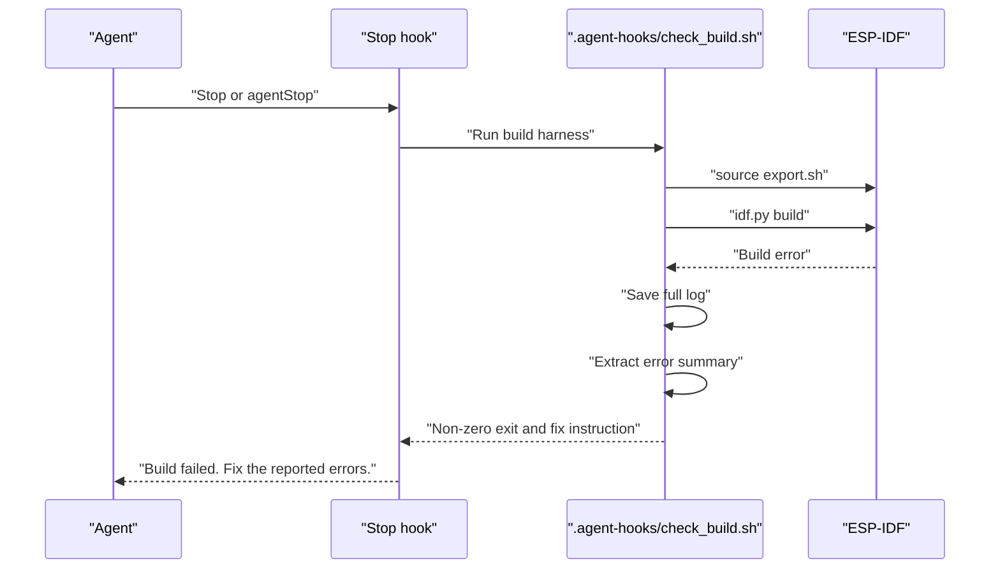

# 設計

## 1. 設計方針

本プロジェクトは「収集装置」ではあるが、単なる画像保存機ではない。設計上の主目的は、`うつ伏せ検知モデルの学習データを確実に作ること` である。

そのため、設計上の最重要点は次の 5 つとする。

- 画像本体を必ず保存する
- 被写体リーク防止のため `subject_id` を必須入力にする
- 曖昧サンプルを負例へ混入させないため `is_usable_for_training` と `exclude_reason` を持つ
- 環境偏り監査のため `location_id`, `lighting_id`, `camera_position_id`, `annotator_id` を必須入力にする
- 画像とメタデータの整合を壊さずエクスポートできる

加えて、本設計は `Freenove ESP32-S3 WROOM CAM` で収集した画像を PC 上へ持ち出し、`ESP-DL` 用モデル生成まで再現できることを前提にする。
さらに、最終成果物は PC 上の学習済みモデルではなく、同ボード上でライブカメラ入力に対して安定動作する `.espdl` 推論系とする。

## 2. 論理構成

### 2.1 `wifi_service`

- `sdkconfig` から `SSID` / `PASSWORD` を読む
- `STA` モードで既存 AP に接続する
- 切断時は自動再接続する

### 2.2 `camera_service`

- `Freenove ESP32-S3 WROOM CAM` のピン設定で初期化する
- JPEG フレームを取得する
- ストリーミングと静止画保存で同じカメラを利用する

### 2.3 `annotation_service`

- Web UI から `subject_id`, `session_id`, `location_id`, `lighting_id`, `camera_position_id`, `annotator_id`, `label`, `is_usable_for_training`, `exclude_reason`, `notes` を受け取る
- 必須項目の妥当性を検証する
- 学習利用不可サンプルが誤って通常ラベルに混ざらないよう整形する

### 2.4 `storage_service`

- SD カードをマウントする
- `dataset/images/` に JPEG を保存する
- `dataset/metadata.csv` にメタデータを追記する
- 画像保存成功後のみ CSV を追記する
- CSV 追記失敗時は画像をロールバックする
- 保存、エクスポート、リセットの排他制御を持つ
- エクスポート用に画像一覧をページ単位で列挙できる

### 2.5 `web_service`

- `/`
- `/stream`
- `/api/status`
- `/api/capture`
- `/api/export/manifest`
- `/api/export/metadata`
- `/api/export/image`
- `/api/reset`
  を提供する
- Web UI のストリーミング表示上に顔検出結果と同期したバウンディングボックスを重ねて表示する

### 2.6 `pc_pipeline`

- `Freenove ESP32-S3 WROOM CAM` 由来の `metadata.csv` と JPEG を取り込む
- `is_usable_for_training=1` かつ `exclude_reason=""` の行だけを学習候補にする
- `subject_id` 単位で `train / val / test` に分割する
- JPEG を RGB 化し、`96 x 96` へ正規化した学習入力を作る
- 分割比率の既定値は `0.70 / 0.15 / 0.15`、乱数シード既定値は `42` とする
- PC 上で学習済み `float` モデルを生成する
- 学習済みモデルを `ONNX` へ変換し、さらに `ESP-DL` 用成果物へ変換する
- 分割定義、評価結果、変換済みモデルを保存し、同条件で再生成できるようにする

### 2.7 `inference_service`

- `.espdl` を `Freenove ESP32-S3 WROOM CAM` 上で読み込む
- ライブフレームに PC 側と同一前処理を適用する
- `non_prone`, `prone` の 2 クラス出力を返す
- 検証時は PC 側量子化参照と一致比較できるログを出す

## 3. データモデル設計

### 3.1 ディレクトリ構成

```text
/sdcard/
  dataset/
    metadata.csv
    images/
      <capture_id>.jpg
```

### 3.2 1 レコードの責務

`metadata.csv` の 1 行は 1 枚の画像に対応する。

1 レコードが持つべき意味は以下とする。

- 何を撮ったか
- 誰を撮ったか
- どの収集単位で撮ったか
- どの環境で撮ったか
- 誰が注釈したか
- その画像を学習に使ってよいか
- 使えないならなぜ使えないか
- PC 側の `ESP-DL` モデル生成へ採用してよいか

## 4. ID 設計

### 4.1 `capture_id`

- 1 撮影ごとに一意
- 画像ファイル名と対応する

### 4.2 `subject_id`

- 被写体単位 ID
- 学習/検証/評価分割の最小単位
- 欠損を許可しない

### 4.3 `session_id`

- 同一被写体、同一撮影環境、同一時間帯の連続収集単位
- 1 つの `session_id` に異なる `subject_id` を混在させない

### 4.4 `board_name`

- 取得元ハード識別子
- 本プロジェクトでは `Freenove ESP32-S3 WROOM CAM` 固定とする
- PC 側で学習対象を他ボード収集データと混在させないために使う

## 5. 保存シーケンス

1. オペレータが `subject_id`, `session_id`, `label`, `is_usable_for_training`, `exclude_reason` を入力する
2. オペレータが `location_id`, `lighting_id`, `camera_position_id`, `annotator_id`, `notes` を入力する
3. `annotation_service` が入力妥当性を検証する
4. `camera_service` が現在フレームを JPEG として取得する
5. `storage_service` が `dataset/images/<capture_id>.jpg` を保存する
6. 画像保存成功後に `dataset/metadata.csv` へ 1 行追記する
7. CSV 追記に失敗した場合は画像を削除して失敗を返す

保存時点で、後段で必要になる次の再現情報が欠けてはならない。

- 元画像サイズ
- JPEG 圧縮設定
- 取得ボード識別子
- 収集日時
- 被写体識別子

## 6. 曖昧サンプル混入防止設計

姿勢ラベルと学習利用可否を分離する。

- `label`
  姿勢ラベル
- `is_usable_for_training`
  学習使用可否
- `exclude_reason`
  使用不可理由

これにより以下を防ぐ。

- 横向きや途中姿勢を `non_prone` に押し込む事故
- 被写体不在画像を負例として学習させる事故
- ブレ画像を正常サンプルとして混入させる事故

## 7. 分割リーク防止設計

データ分割は `subject_id` 単位で行うことを前提にする。

- `subject_id` がないサンプルは学習母集団に入れない
- `session_id` は時系列監査やセッション偏り分析に使う
- `location_id`, `lighting_id`, `camera_position_id` は環境偏り監査に使う
- `timestamp_ms` は連写偏りや時系列リーク検査に使う

## 8. エクスポート設計

エクスポートは「ESP32 側で途中エラーを起こしにくく、PC 側で再開可能に取り切れること」を目的とする。

含めるもの:

- `metadata.csv`
- `images/` 配下の全 JPEG

要件:

- `metadata.csv` は単独 API で取得する
- 画像一覧はマニフェスト API でページ単位に取得する
- 画像本体は 1 画像 1 リクエストで取得する
- 画像取得は `capture_id` 指定で再試行可能とする
- 展開後に `image_path` から画像へ到達できる
- CSV だけでもサンプル品質確認と分割判定ができる
- 画像を見ればラベル監査ができる
- 単一レスポンスで全画像を束ねる設計は禁止する

## 8.1 顔検出オーバーレイ設計

- 顔検出は `human_face_detect` を使い、ライブストリームで取得した JPEG フレームから一定間隔で実行する
- 検出結果はストリーム送信と同じフレーム寸法に対する座標として保持する
- `GET /api/face-detections` は最新の検出結果を JSON で返す
- Web UI は `stream_frame` の内部に bbox を絶対配置して重ねる
- bbox は検出された全顔を表示し、未検出時は描画しない
- 顔検出失敗時も撮影 API と MJPEG 配信は継続し、表示だけを空に戻す
- 緑系の半透明枠とし、中央塗りつぶしは最小限にして画像確認の妨げを避ける

## 9. PC モデル生成設計

PC 側は次の段階で処理する。

1. 生データ監査
2. 学習対象フィルタ
3. `subject_id` 単位分割
4. 画像前処理固定化
5. `float` モデル学習
6. `ONNX` 変換
7. `ESP-DL` 用変換
8. 量子化後評価
9. 実機搭載前一致確認
10. 実機受け入れ試験

この段階で固定する事項は以下とする。

- 入力画像は RGB 3 チャンネル
- 入力サイズは `96 x 96`
- 出力は 2 要素で、順序は `non_prone`, `prone`
- 分割単位は `subject_id`
- 初期ハイパーパラメータは `epoch=20`, `batch_size=32`, `learning_rate=0.001`
- 初期判定閾値は `0.50`
- 量子化後モデルは元の分割定義と評価結果に紐付ける
- 判定閾値は検証データで決めて固定する
- 実機前処理は PC 側評価コードと同一にする

PC 側成果物として最低でも以下を残す。

- 分割済み一覧
- 学習用ディレクトリ
- 前処理条件
- 学習済み `float` モデル
- `ONNX`
- `ESP-DL` 形式モデル
- 評価指標
- 生成日時と元データ識別情報
- 固定済み判定閾値
- PC 量子化参照出力

### 9.1 `pc_pipeline` 出力ディレクトリ

```text
artifacts/
  pc_pipeline/
    <run_name>/
      config.json
      dataset_audit.json
      splits/
        train.csv
        val.csv
        test.csv
      training_dirs/
        train/
          non_prone/
          prone/
        val/
          non_prone/
          prone/
        test/
          non_prone/
          prone/
      checkpoints/
        best_model.pt
      onnx/
        model.onnx
      espdl/
        model.espdl
      references/
        quantized/
          train.csv
          val.csv
          test.csv
      reports/
        metrics.json
        threshold.json
        quantized_reference.json
        training_directories.json
```

### 9.2 `pc_pipeline` 失敗条件

- 依存ライブラリ不足時は不足名を列挙して即停止する
- `metadata.csv` 欠損、画像欠損、破損画像があれば監査結果へ記録し、学習開始前に停止する
- 学習対象 `subject_id` が `3` 未満なら `train / val / test` 分割を作らず停止する
- `val` または `test` が空になる場合は既定分割比率を崩さず停止する
- `ESP-DL` 変換コマンド未指定時は `float` モデルと `ONNX` 生成までで停止できるようにする

### 9.3 学習用ディレクトリ分割ツール

- 既存の `splits/train.csv`, `splits/val.csv`, `splits/test.csv` に対応する画像ディレクトリ木を生成できること
- 出力構造は `train / val / test` の下に `non_prone / prone` を持つこと
- 既定の出力方法は `symlink` とし、必要時のみ `copy` を選べること
- 既定の出力先は `artifacts/pc_pipeline/<run_name>/training_dirs/` とする
- 再実行時は既存の同一出力先内容を置き換え、古い混在を残さないこと

### 9.4 PC 量子化参照評価

- 初期実装では、RGB 正規化後テンソルを 8bit 格子へ丸める疑似量子化を PC 側参照とする
- 量子化参照評価は `train / val / test` の全分割で実施する
- 分割ごとの指標は `reports/quantized_reference.json` に保存する
- 分割ごとのサンプル別予測は `references/quantized/*.csv` に保存する
- 後続の `.espdl` 比較はこの参照結果を基準にする

## 10. 実機推論設計

実機推論では次を満たす。

- カメラ入力元は `Freenove ESP32-S3 WROOM CAM` のライブフレーム
- リサイズ、色変換、正規化、テンソル並び順は PC 側と一致
- 出力順は `non_prone`, `prone`
- 実機検証では同一入力に対する PC 側量子化参照との差分を確認する
- 判定閾値は検証データで決めた固定値を使う

実機受け入れで必要な確認項目は以下とする。

- モデル読み込み成功
- 連続推論中に停止しない
- `prone` の見逃しが許容値以内
- `non_prone` の誤検知が許容値以内
- 推論ログと正解ラベルを突合できる

## 11. リセット設計

- 対象は `dataset/images/` と `dataset/metadata.csv`
- 実行前に確認操作を必須とする
- 実行後はヘッダ付き空 CSV を再生成する

## 12. ステータス設計

`/api/status` では少なくとも以下を返す。

- Wi-Fi 状態
- カメラ状態
- SD カード状態
- 収集済みサンプル件数
- 学習利用可サンプル件数
- 学習除外サンプル件数
- 直近保存時刻

## 13. 運用設計

学習データを成立させるため、運用ルールも設計対象とする。

- `subject_id` 命名規則を固定する
- `session_id` 命名規則を固定する
- `location_id`, `lighting_id`, `camera_position_id`, `annotator_id` の命名規則を固定する
- `exclude_reason` の語彙を固定する
- 曖昧なら保存しない、または `is_usable_for_training=0` で保存する
- PC 側へエクスポートした後も、元の `metadata.csv` と画像一式は再現用に保持する
- `board_name=Freenove ESP32-S3 WROOM CAM` 以外の行は本モデル生成フローへ入れない
- 実機受け入れ試験に使う評価動画または評価画像集合は学習集合と分離する
- 閾値変更を行った場合は再度 PC 評価と実機評価をやり直す
- `metadata.csv` は既存20列の順序と意味を固定し、新規列は末尾追加のみ許可する
- `subject_id` と `session_id` は運用台帳で事前登録して重複や混在を防ぐ
- 学習利用可否の変更は履歴ファイルへ追記し、上書き監査不能な運用を禁止する

## 14. この設計で担保すること

この設計は、次を保証するためのものとする。

- 画像監査可能
- 被写体リーク防止可能
- 曖昧サンプル除外可能
- 収集後に学習用フィルタを機械的に適用可能
- PC 上で `ONNX` および `ESP-DL` モデル生成条件を再現可能
- 最終的に `Freenove ESP32-S3 WROOM CAM` 上での検知成立条件を監査可能

## 15. エージェント停止時 ESP-IDF ビルド/サイズハーネス設計

### 15.1 設計方針

Codex CLI と Copilot CLI の hook 差分を各設定ファイルへ閉じ込め、ビルド実行、サイズ確認、ログ保存、失敗時メッセージ生成は `.agent-hooks/` の共有ハーネスへ集約する。

これにより、ESP-IDF 環境解決やエラー要約の挙動を 1 箇所で保守できる。

### 15.2 論理構成



### 15.3 ディレクトリ責務

`.agent-hooks/` は共有ハーネスの責務を持つ。

- ESP-IDF 環境解決
- `export.sh` 読み込み
- `idf.py build` 実行
- `check_size.sh` を用いた 6 MiB 上限のサイズ確認
- ログ保存
- エラー要約
- エージェント向け修正指示の生成

`.codex/` は Codex CLI 用 hook 定義だけを持つ。

`.github/hooks/` は Copilot CLI 用 hook 定義だけを持つ。

### 15.4 失敗時シーケンス



### 15.5 環境解決設計

`IDF_PATH` が存在する場合は、現在の shell または CLI が提供した環境を尊重する。

`IDF_PATH` が存在しない場合は、このリポジトリの ESP-IDF v6.0 標準に合わせ、`$HOME/.espressif/v6.0/esp-idf` を候補にする。

`IDF_TOOLCHAIN_PATH` には依存しない。ESP-IDF の export は toolchain を `PATH` へ追加するため、特定の toolchain 環境変数を前提にしない。

既存 `build/` がある場合、`build/CMakeCache.txt` に記録された `PYTHON` と異なる Python 環境で `idf.py build` を実行すると ESP-IDF が停止する。同じ venv でも `python` と `python3` の実行パス文字列が異なると失敗するため、`CMakeCache.txt` から構成済み Python を検出し、その Python で `$IDF_PATH/tools/idf.py build` を実行する。

### 15.6 サイズ確認設計

build 成功後に `source "$HOME/.espressif/v6.0/export.sh" && idf.py size` を実行し、`Total image size` が 6 MiB 以下なら成功とする。

### 15.7 エラー要約設計

失敗時は全ログを返すのではなく、修正に必要な行を優先して抽出する。

優先する語句は次とする。

- `error:`
- `warning:`
- `FAILED:`
- `CMake Error`
- `ninja failed`
- `undefined reference`
- `No such file or directory`

抽出できない場合はログ末尾を返す。

hook ランナーへは stdout の JSON で停止指示を返し、stderr には人間が読める要約を返す。JSON には `continue=false` と Codex `Stop` 用の `decision=block` を両方含める。

### 15.8 保守方針

- hook 設定ファイルに ESP-IDF 環境解決ロジックを書かない
- 共有ハーネスに CLI 固有イベント名の分岐を持たせない
- build 以外の destructive 操作を実行しない
- firmware flash はこの hook の責務に含めない

## 16. C 言語安全ハーネス設計

### 16.1 目的

セグメンテーションフォルトや OOM を起こしやすい C/C++ の書き方を、ビルド時に検出して止める。

### 16.2 対象範囲

- 自前コードの `main/`
- プロジェクト内 `components/`
- ベンダー由来の `components/espressif__*` と `managed_components/` は対象外

### 16.3 強制方式

- `components/safety_harness/include/safety_harness.h` に安全ラッパーを置く
- `SH_ALLOC_BYTES`, `SH_CALLOC`, `SH_FREE`, `SH_SAFE_RETURN_IF_NULL` を提供する
- `components/safety_harness/tools/check_safety_rules.py` で禁止 API をビルド時に検査する

### 16.4 禁止対象

- `malloc`
- `calloc`
- `realloc`
- `free`
- `strcpy`
- `strcat`
- `sprintf`
- `vsprintf`
- `gets`
- `alloca`

### 16.5 運用

- 禁止 API は自前コードに残さない
- 動的確保は安全ラッパー経由に統一する
- ルール違反が見つかったら configure 時点で失敗させる
